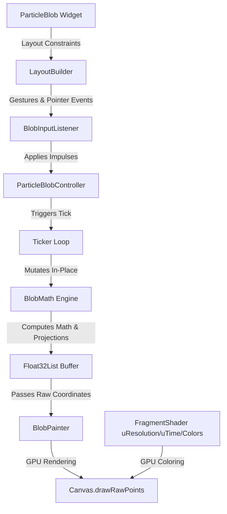

<div align="center">

# Particle Blob 3D
### Developer & Architecture Reference

**A high-performance, interactive 3D particle blob package for Flutter featuring advanced Fibonacci sphere distribution, GPU-accelerated shading, and real-time noise morphing.**

<p align="center">
  
  
</p>

> [!IMPORTANT]
> **Active Development Branch (`dev`)**  
> This branch is dedicated to active development, feature experimentation, and integration. APIs and implementations here may be unstable. For production-ready releases, please use the `main` branch or the official releases published on [pub.dev](https://pub.dev).

---

<p align="center">
  <a href="#core-architecture"><b>Core Architecture</b></a> •
  <a href="#quick-start"><b>Quick Start</b></a> •
  <a href="#api-reference"><b>API Reference</b></a> •
  <a href="#mathematical-mechanics"><b>Mathematical Mechanics</b></a> •
  <a href="#performance-optimizations"><b>Optimizations</b></a>
</p>

</div>

---

## Core Architecture

`ParticleBlob` is engineered for high-frequency interactive graphics in Flutter without triggering CPU bottlenecking or garbage collection (GC) stutters. The system isolates concerns into distinct, highly optimized components:



1. **Gestures & Inputs ([BlobInputListener](file:///home/dexter/flutter_library/particle_blob/lib/src/blob_input_listener.dart)):** Tracks pan gestures, mouse hovering, and multi-touch points, passing raw screen-space impulses to the controller.
2. **State & Physics ([ParticleBlobController](file:///home/dexter/flutter_library/particle_blob/lib/src/particle_blob_controller.dart)):** Manages user configuration parameters, maintains rotation state, and applies frame-rate-independent damping.
3. **Mathematical Engine ([BlobMath](file:///home/dexter/flutter_library/particle_blob/lib/src/blob_math.dart)):** Executes 3D coordinates rotation, noise deformation, touch-radial dispersion, and perspective projection.
4. **Low-Level Renderer ([BlobPainter](file:///home/dexter/flutter_library/particle_blob/lib/src/blob_painter.dart)):** Utilizes Flutter's low-level `Canvas.drawRawPoints` API to render thousands of points in a single GPU draw call, powered by a customized fragment shader (`blob.frag`) for GPU-side color gradients.

---

## Quick Start

### 1. Import the Package

```dart
import 'package:particle_blob/particle_blob.dart';
```

### 2. Basic Setup
Add the widget directly inside your layout tree. It will automatically adapt to its parent layout constraints.

```dart
ParticleBlob(
  particleCount: 5000,
  radius: 130,
  pointSize: 2.0,
  gradient: LinearGradient(
    colors: [Colors.pinkAccent, Colors.deepPurpleAccent],
  ),
)
```

### 3. Programmatic Control (Controller Integration)
Instantiate a `ParticleBlobController` to manipulate physical and aesthetic properties dynamically (e.g., reacting to voice input, audio frequencies, or gestures).

```dart
class MyWidgetState extends State<MyWidget> {
  late final ParticleBlobController _controller;

  @override
  void initState() {
    super.initState();
    _controller = ParticleBlobController(
      dampingFactor: 0.93,   // Rotation momentum decay rate (0.0 - 1.0)
      tapScaleFactor: 1.2,   // Dispersion multiplier on touch
    );
  }

  void animateBlob() {
    _controller.setBlobiness(2.5);         // Increase distortion amplitude
    _controller.setSpeed(2.0);             // Double animation speed
    _controller.setViewDistance(1.8);      // Adjust 3D camera distance
    _controller.setIsRainbowMode(true);    // Cycle colors dynamically
  }

  @override
  void dispose() {
    _controller.dispose();
    super.dispose();
  }

  @override
  Widget build(BuildContext context) {
    return ParticleBlob(
      controller: _controller,
      particleCount: 6000,
      radius: 150.0,
    );
  }
}
```

---

## API Reference

### Widget Configurations (`ParticleBlob`)

| Property | Type | Default | Description |
| :--- | :--- | :--- | :--- |
| `particleCount` | `int` | `5000` | Total number of particles to allocate and render. |
| `radius` | `double` | `150.0` | Base radius of the 3D sphere in logical pixels. |
| `pointSize` | `double` | `2.0` | Render size of each individual particle point. |
| `tapScaleFactor` | `double` | `1.0` | Base scaling multiplier for tap/touch particle dispersion. |
| `gradient` | `Gradient` | `LinearGradient(...)` | Color spectrum used to paint the blob. |
| `controller` | `ParticleBlobController?` | `null` | Optional external controller for runtime state manipulation. |

### Controller State & Methods (`ParticleBlobController`)

| Property / Setter | Type | Default | Range | Description |
| :--- | :--- | :--- | :--- | :--- |
| `dampingFactor` / `setDampingFactor()` | `double` | `0.92` | `0.0` - `1.0` | Decay rate of drag-induced angular momentum per frame. |
| `tapScaleFactor` / `setTapScaleFactor()` | `double` | `1.0` | `>= 0.0` | Scaling coefficient for touch dispersion physics. |
| `blobiness` / `setBlobiness()` | `double` | `1.0` | `0.0` - `5.0` | Deformation amplitude (displacement depth from perfect sphere). |
| `speed` / `setSpeed()` | `double` | `1.0` | `0.0` - `10.0` | Time multiplier for noise transformation. |
| `dispersion` / `setDispersion()` | `double` | `0.0` | `0.0` - `3.0` | Uniform/manual radial dispersion coefficient. |
| `autoRotationSpeed` / `setAutoRotationSpeed()` | `double` | `0.5` | `-3.0` - `3.0` | Constant angular speed (Y-axis spin velocity). |
| `noiseFrequency` / `setNoiseFrequency()` | `double` | `1.0` | `0.1` - `5.0` | Morphing wave frequency (controls spikiness/wave count). |
| `viewDistance` / `setViewDistance()` | `double` | `2.0` | `0.8` - `5.0` | Perspective camera distance (Z-depth multiplier). |
| `isRainbowMode` / `setIsRainbowMode()` | `bool` | `false` | `true` / `false` | Enables real-time HSV color cycling. |
| `rotationX` / `rotationY` | `double` | `0.0` | Read-only | Current accumulated angular rotation (radians). |
| `addRotationImpulse(Offset)` | `void` | - | - | Injects an angular velocity delta (e.g., from drag events). |
| `resetRotation()` | `void` | - | - | Immediately resets accumulated rotation angles to zero. |

---

## Mathematical Mechanics

The math engine resides in [BlobMath](file:///home/dexter/flutter_library/particle_blob/lib/src/blob_math.dart).

### 1. Fibonacci Sphere Distribution
To distribute $N$ points evenly on a 3D sphere surface, the library uses a Fibonacci lattice distribution in [BlobMath.generateFibonacciSphere](file:///home/dexter/flutter_library/particle_blob/lib/src/blob_math.dart#L23-L40):

$$y_i = 1.0 - \left(\frac{i}{N - 1}\right) \times 2.0$$
$$r_i = \sqrt{1.0 - y_i^2}$$
$$\theta_i = i \times \Phi$$
$$x_i = \cos(\theta_i) \times r_i$$
$$z_i = \sin(\theta_i) \times r_i$$

Where $i \in [0, N-1]$ and $\Phi$ is the golden angle:
$$\Phi = \pi \times (3.0 - \sqrt{5.0}) \approx 2.399963 \text{ rad}$$

This ensures optimal visual spacing without clusters or polar distortion.

### 2. Organic Sine-Wave Deformation (Morphing)
A high-performance 3D trigonometric noise function applies dynamic wave displacements to the base sphere coordinates in [BlobMath.projectParticles](file:///home/dexter/flutter_library/particle_blob/lib/src/blob_math.dart#L90-L108):

$$\text{noise} = \sin(3fx + t) \times \cos(2fy - t) \times \sin(4fz + 1.5t)$$
$$\text{displacement} = 1.0 + \text{noise} \times 0.3 \times \text{blobiness}$$

Where $f$ is the `noiseFrequency`, $t$ is the elapsed simulation `time`, and $(x, y, z)$ are the base spherical coordinates.

### 3. Perspective Camera Projection
Rotated coordinates $(x_{\text{rot}}, y_{\text{rot}}, z_{\text{rot}})$ are projected into 2D view space using a perspective division formula:

$$\text{safeZ} = \text{clamp}(viewDistance + z_{\text{rot}}, 0.1, 10.0)$$
$$\text{scale} = \frac{radius}{\text{safeZ}}$$
$$X_{\text{screen}} = X_{\text{center}} + x_{\text{rot}} \times \text{scale} \times 2.0$$
$$Y_{\text{screen}} = Y_{\text{center}} + y_{\text{rot}} \times \text{scale} \times 2.0$$

---

## Performance Optimizations

`ParticleBlob` bypasses common performance pitfalls in Flutter rendering:

* **Zero GC Pressure (Allocationless Render Loop):**  
  Instantiating Dart objects (e.g. `Offset`, `Vector3`, or coordinate lists) at 60/120 FPS triggers frequent Garbage Collection (GC) pauses, causing UI lag. Instead, `ParticleBlob` utilizes a flat, continuous `Float32List` array representation of vertices. All mathematical transforms, rotations, and deformations mutate this flat array in-place, yielding **zero heap allocations** in the render ticker callback.
* **Single-Draw GPU Execution:**  
  Rendering thousands of nodes as individual Flutter widgets creates massive element-tree overhead. `ParticleBlob` formats its coordinates into a flat coordinate list and executes a single draw call via `Canvas.drawRawPoints` within [BlobPainter](file:///home/dexter/flutter_library/particle_blob/lib/src/blob_painter.dart#L10-L47).
* **GPU-Powered Pixel Shaders:**  
  CPU-side color computation for individual particles slows down the main runtime thread. We utilize a custom fragment shader (`blob.frag`) loaded asynchronously via `ui.FragmentProgram.fromAsset`. This offloads 3D gradient mapping, resolution adjustments, and HSV rainbow cycling directly onto the GPU.
* **Repaint Isolation:**  
  By embedding the painter inside a `ValueListenableBuilder<int>` triggered by an incremental frame ticker, and wrapping the output in a `RepaintBoundary`, we ensure that only the [CustomPaint](file:///home/dexter/flutter_library/particle_blob/lib/src/particle_blob_widget.dart#L317-L329) widget repaints. The surrounding Flutter widget tree is completely untouched, eliminating redundant layout and paint cycles.
